# Parcel Guard — Proactive Parcel SLA Breach Detection, XAI Diagnostics & Causal Remediation Engine

Parcel Guard is an overlay intelligence layer designed for logistics operations. It continuously monitors live parcel micro-telemetry streams, proactively predicts Service Level Agreement (SLA) breaches using a CatBoost + LightGBM Quantile Ensemble, diagnoses root causes using TreeSHAP, estimates counterfactual hours saved via EconML Double Machine Learning (DML), optimizes fleet-wide intervention capacity via Binary Integer Linear Programming (ILP), and exposes a FastAPI REST suite.

---

## System Architecture

```mermaid
flowchart TD
    subgraph Data Layer
        A1["DataCo Supply Chain Dataset\n(data/DataCoSupplyChainDataset.csv)"] --> B["Data Ingestion & Feature Enrichment\n(data_engine.py)"]
        A2["Olist E-Commerce Dataset\n(data/Brazilian E-Commerce Public Dataset by Olist.csv)"] --> B
        B --> C["Micro-Telemetry Snapshots\n[distance, hub_waiting, weather, traffic, carrier, priority, origin, dest, delay]"]
    end

    subgraph Intelligence & Modeling Engine
        C --> D["Predictive Guard Ensemble\n(models.py: CatBoost + LGBM Quantile Engine)"]
        C --> E["Diagnostic Layer\n(models.py: TreeSHAP Engine)"]
        C --> F["Causality Layer\n(causal_engine.py: EconML CausalForestDML)"]
        C --> G["Advanced Analytics\n(advanced_analytics.py)"]
        
        D --> D1["CatBoost Regressor (Categorical Features)"]
        D --> D2["LightGBM Quantile Regressors (alpha = 0.10, 0.50, 0.90)"]
        D --> D3["Meta-Ensemble Stacking Layer (0.50 * LGBM_Q50 + 0.50 * CatBoost)"]
        
        G --> G1["DirectLiNGAM Causal DAG Inference"]
        G --> G2["CoxPH Survival Curve P(Breach | t)"]
        G --> G3["Conformal Uncertainty Intervals (90%)"]
        G --> G4["DoWhy 3-Method Refutation Suite"]
    end

    subgraph Decision & Optimization Engine
        C --> H["Fleet Optimizer\n(fleet_optimizer.py)"]
        H --> H1["SciPy / PuLP Binary ILP Solver"]
        H --> H2["Deterministic Financial Logic ($25-$100 penalty)"]
        H --> H3["SHAP-to-Customer Dispatch Messaging"]
    end

    subgraph REST API Suite
        D --> I["FastAPI Suite (main.py) & State Store"]
        E --> I
        F --> I
        G --> I
        H --> I
        
        I --> J1["GET /parcel/{id}/promise"]
        I --> J2["POST /parcel/{id}/delivery-action"]
        I --> J3["GET /parcels/at-risk"]
        I --> J4["GET /analytics/roi-dashboard"]
        I --> J5["POST /fleet/optimize-batch"]
        I --> J6["GET /parcel/{id}/customer-message"]
        I --> J7["POST /simulation/stress-test"]
    end
```



---

## Theoretical Rationale & Methodology: Why Specific Approaches Were Chosen

### 1. Why CatBoost + LightGBM Quantile Multi-Model Ensemble?
- **Handling High-Cardinality Categorical Logistics Features**: Logistics networks depend heavily on categorical metadata such as `carrier_id`, `priority_tier`, `origin_hub`, and `destination_hub`. CatBoost uses Ordered Target Statistics to encode high-cardinality categorical features without target leakage or overfitting.
- **Asymmetric Risk Bounds via Quantile Regression**: Mean squared error (MSE) regressors output point estimates $\hat{Y} = \mathbb{E}[Y \mid X]$, which treats early and late prediction errors symmetrically. LightGBM Quantile Regressors optimize the pinball loss at $\alpha \in \{0.10, 0.50, 0.90\}$, providing lower bounds ($q_{10}$), median delay ($q_{50}$), and conservative upper risk bounds ($q_{90}$). SLA breach risk is flagged if $q_{90} > 0$.
- **Meta-Ensemble Stacking**: Combines median LightGBM ($q_{50}$) and CatBoost predictions using a equal-weighted stacking layer ($\hat{Y}_{\text{ensemble}} = 0.5 \hat{Y}_{\text{LGBM\_Q50}} + 0.5 \hat{Y}_{\text{CatBoost}}$), achieving lower variance and higher generalization across diverse hub networks.

### 2. Why Double Machine Learning (DML) / EconML for CATE Estimation?
- **The Problem with Naive Regression**: In observational logistics data, packages operating under severe weather or longer remaining distances are far more likely to be rerouted to parcel lockers ($T = 1$) by operational staff. Standard supervised regressors or Ordinary Least Squares (OLS) estimate $\mathbb{E}[Y \mid T=1] - \mathbb{E}[Y \mid T=0]$. This conflates the baseline severity of the environment with the true effect of locker rerouting, causing severe **selection bias** and **confounding**.
- **The DML Orthogonalization Solution**: Double Machine Learning uses the **Frisch-Waugh-Lovell theorem** extended to non-parametric machine learning. DML fits two separate nuisance models:
  1. $\hat{m}_Y(W)$: Predicts outcome $Y$ from confounders $W = [\text{distance}, \text{weather}, \text{traffic}]$.
  2. $\hat{m}_T(W)$: Predicts treatment assignment propensity $T$ from confounders $W$.
  
  By taking residuals $\tilde{Y} = Y - \hat{m}_Y(W)$ and $\tilde{T} = T - \hat{m}_T(W)$, DML strips away confounding variation, isolating the unconfounded treatment effect $\tau(X)$ on $\tilde{Y} = \tau(X) \cdot \tilde{T} + \nu$. This guarantees root-$N$ rate convergence ($\sqrt{N}$) for the CATE estimator even when using flexible machine learning algorithms like LightGBM for the first stage.

### 3. Why Heterogeneous CATE $\tau(X)$ for Parcel Locker Rerouting?
- **Operational Reality**: Rerouting a package to a parcel locker bypasses sorting hub congestion because lockers receive direct consolidated drop-offs.
- **Heterogeneity**: If a package is experiencing severe sorting hub delays ($\text{hub\_waiting\_time\_hrs} > 1.5$ hrs), locker rerouting provides high delay reduction ($\tau(X) = -3.0$ hrs). If hub delay is minimal ($\le 1.5$ hrs), rerouting only provides modest benefit ($\tau(X) = -0.5$ hrs). Modeling CATE heterogeneously allows the system to target interventions specifically to high-impact parcels.

### 4. Why TreeSHAP for Root Cause Diagnostics?
- **Global vs. Local Feature Attribution**: Global importance metrics (Mean Decrease Impurity or Permutation Importance) describe overall model behavior across the dataset, but fail to explain *why a specific package is breaching SLA*.
- **Game Theoretic Axioms**: TreeSHAP computes exact Shapley values derived from cooperative game theory, satisfying three fundamental mathematical properties:
  1. **Local Accuracy**: $\hat{Y}(x) = \phi_0 + \sum_{i=1}^M \phi_i(x)$.
  2. **Consistency**: If a feature's impact increases, its Shapley value never decreases.
  3. **Missingness**: Zero impact features receive zero attribution.
- This produces additive hour attributions (e.g. `weather_severity` added $+1.63$ delay hours) per parcel, enabling transparent, deterministic customer messaging.

### 5. Why Cox Proportional Hazards for Survival Breach Probabilities?
- **Limitations of Binary Classification**: Binary classifiers predict breach status at a static threshold (e.g. at delivery completion). They cannot answer: *"What is the probability this parcel breaches SLA if it remains in transit for the next 6 hours vs 12 hours?"*
- **Dynamic Time-to-Event Modeling**: Cox Proportional Hazards models the hazard rate $h(t \mid X) = h_0(t) \exp(\beta^T X)$. This allows computing continuous survival functions $S(t) = P(\text{Delay} \le 0 \mid t_{\text{remaining}})$ and extracting exact breach probabilities $P(\text{Breach}) = 1 - S(t)$ at dynamic lead time windows ($N \in \{2, 6, 12, 24\}$ hours).

### 6. Why Conformal Uncertainty Prediction Intervals (MAPIE)?
- **Failure of Gaussian Residual Assumptions**: Standard regression models output point predictions $\hat{Y}$ and assume Gaussian error distribution $\epsilon \sim \mathcal{N}(0, \sigma^2)$ to construct symmetric confidence bounds $\hat{Y} \pm 1.96\sigma$. In logistics, delay distributions are right-skewed with heavy tails due to unexpected traffic spikes and weather events.
- **Distribution-Free Guarantee**: Conformal prediction calculates non-parametric residual quantiles from calibration data, guaranteeing finite-sample coverage $1 - \alpha = 90\%$ without relying on any distributional assumptions:
  $$P\left(Y_{\text{new}} \in [\hat{Y}_{\text{new}} + q_{\alpha/2}, \; \hat{Y}_{\text{new}} + q_{1-\alpha/2}]\right) \ge 0.90$$

### 7. Why Binary Integer Linear Programming (ILP) for Fleet Optimization?
- **Flaws of Greedy Sorting**: A naive greedy strategy sorts at-risk parcels by estimated savings and fills lockers sequentially. This fails when physical locker capacities are constrained, higher-priority parcels (`VIP`, `EXPRESS`) compete for slots, or low-impact interventions ($\tau < 1.5$ hrs) waste limited locker capacity.
- **Global Optimality**: Binary Integer Linear Programming (ILP) formulates the multi-parcel, multi-locker allocation problem as a constrained mathematical optimization problem. It guarantees globally optimal allocation of physical locker slots while enforcing operational constraints and maximizing net financial dollars protected.

### 8. Why 6-Hour Advance Detection Rate ($ADR_6$)?
- **Operational Lead Time Window**: Predicting an SLA breach 15 minutes before failure is actionable zero for logistics controllers. A minimum lead time of 6 hours ($N = 6$) is required for dispatch hubs to reroute vehicles or notify locker networks.
- **Metric Formulation**: $ADR_6$ specifically measures the proportion of actual SLA breaches detected $\ge 6$ hours in advance:
  $$ADR_6 = \frac{\text{Actual breaches detected } \ge 6 \text{ hours before ETA}}{\text{Total actual SLA breaches}}$$

---

## Dataset Ingestion & Hybrid Telemetry Engine

Parcel Guard loads real shipment metadata from two datasets located in `./data/`:
1. **DataCo Supply Chain Dataset** (`data/DataCoSupplyChainDataset.csv`) — Ingests real order IDs, order purchase/shipping timestamps, customer locations, and shipping modes.
2. **Olist Brazilian E-Commerce Dataset** (`data/Brazilian E-Commerce Public Dataset by Olist.csv`) — Ingests order timestamps, customer location zip codes, and promised delivery windows.

### Micro-Telemetry Schema:
| Feature | Data Type | Description / Range |
| :--- | :--- | :--- |
| `tracking_id` | String | Unique package tracking code (e.g. `DC-77202`, `OL-98214`) |
| `current_timestamp` | Datetime ISO | Snapshot timestamp |
| `promised_eta` | Datetime ISO | Promised delivery arrival date/time |
| `distance_remaining_km` | Float | Remaining travel distance in kilometers (5.0 to 450.0 km) |
| `hub_waiting_time_hrs` | Float | Dwell time spent waiting at hub/sorting facility (Exponential, mean 1.5 hrs) |
| `weather_severity` | Float | Normalized weather disruption index (0.0 = clear, 1.0 = severe storm) |
| `traffic_index` | Float | Normalized traffic congestion index (0.0 = free flow, 1.0 = gridlock) |
| `carrier_id` | String | Logistics carrier (`CARRIER_A`, `CARRIER_B`, `EXPRESS_EX`) |
| `priority_tier` | String | Package priority tier (`STANDARD`, `EXPRESS`, `VIP`) |
| `origin_hub` | String | Origin distribution hub (`HUB_SP_01`, `HUB_RJ_02`, `HUB_MG_01`) |
| `destination_hub` | String | Destination hub (`HUB_SOUTH_01`, `HUB_WEST_04`, `HUB_NORTH_02`) |
| `locker_rerouted` | Binary (0/1) | Treatment indicator (0 = standard delivery, 1 = rerouted to parcel locker) |
| `final_actual_delay_hrs` | Float | Target outcome variable (actual delay relative to ETA) |
| `lead_time_hrs` | Float | Remaining time window until promised ETA |

---

## Mathematical Formulations & Causal Equations

### 1. CatBoost + LightGBM Quantile Ensemble Equations
$$\hat{Y}_{\text{CatBoost}} = f_{\text{CatBoost}}(X_{\text{num}}, X_{\text{cat}})$$
$$\hat{q}_{\alpha} = f_{\text{LGBM\_Quantile}}(X_{\text{num}}; \alpha), \quad \alpha \in \{0.10, 0.50, 0.90\}$$
$$\hat{Y}_{\text{predicted}} = 0.50 \cdot \hat{q}_{0.50} + 0.50 \cdot \hat{Y}_{\text{CatBoost}}$$
$$\text{delay\_lower\_bound\_hrs} = \hat{q}_{0.10}, \quad \text{delay\_upper\_bound\_hrs} = \hat{q}_{0.90}$$
$$\text{sla\_breach\_predicted} = \mathbb{I}(\text{delay\_upper\_bound\_hrs} > 0)$$

### 2. Confounders & Propensity Score Model
$$W = [\text{distance\_remaining\_km}, \text{weather\_severity}, \text{traffic\_index}]$$
$$\text{logit}(W) = 0.005 \cdot \text{distance\_remaining\_km} + 2.0 \cdot \text{weather\_severity} - 1.5$$
$$e(W) = P(\text{locker\_rerouted} = 1 \mid W) = \frac{1}{1 + \exp(-\text{logit}(W))}$$

### 3. Heterogeneous CATE Treatment Effect $\tau(X)$
$$\tau(X) = \begin{cases} -3.0 \text{ hours (saves 3.0 hrs)}, & \text{if } \text{hub\_waiting\_time\_hrs} > 1.5 \\ -0.5 \text{ hours (saves 0.5 hrs)}, & \text{otherwise} \end{cases}$$

### 4. Target Outcome Delay Equation
$$Y = 0.6 \cdot \text{hub\_waiting\_time\_hrs} + 3.0 \cdot \text{weather\_severity} + 2.5 \cdot \text{traffic\_index} + \tau(X) \cdot \text{locker\_rerouted} + \epsilon, \quad \epsilon \sim \mathcal{N}(0, 0.5^2)$$

### 5. 6-Hour Advance Detection Rate ($ADR_6$)
$$ADR_N = \frac{\sum_{i=1}^M \mathbb{I}(\hat{Y}_i > 0 \;\land\; \text{lead\_time\_hrs}_i \ge N \;\land\; Y_i > 0)}{\sum_{i=1}^M \mathbb{I}(Y_i > 0)}$$

### 6. Binary Integer Linear Programming (ILP) Fleet Optimization
$$\max_{x_{i,j}} \sum_{i=1}^N \sum_{j=1}^K \left( \text{sla\_penalty\_usd}_i - 4.50 \right) x_{i,j}$$
$$\text{subject to } \sum_{i=1}^N x_{i,j} \le C_j \quad \forall j, \quad \sum_{j=1}^K x_{i,j} \le 1 \quad \forall i, \quad x_{i,j} = 1 \implies \hat{\tau}_i(X) \ge 1.5 \text{ hours}$$

---

## Complete FastAPI API Contracts & Endpoints

### 1. `GET /parcel/{tracking_id}/promise`
Returns realtime CatBoost+LightGBM ensemble prediction, q10/q90 risk bounds, SLA breach risk, advance notice hours, SHAP root causes, conformal intervals, survival breach probabilities, and financial ROI.

- **URL**: `/parcel/{tracking_id}/promise`
- **Method**: `GET`
- **Path Parameter**: `tracking_id` (string) — e.g. `DC-77202`
- **Response `200 OK`**:
```json
{
  "tracking_id": "DC-77202",
  "promised_eta": "2026-09-17T09:28:31.313986",
  "predicted_delay_hrs": 4.2,
  "delay_lower_bound_hrs": 3.1,
  "delay_upper_bound_hrs": 5.4,
  "sla_breach_predicted": true,
  "advance_notice_hours": 35.9,
  "current_status": "STANDARD_DELIVERY",
  "priority_tier": "VIP",
  "root_cause_diagnosis": [
    {
      "feature": "weather_severity",
      "contribution_hrs": 1.63
    },
    {
      "feature": "hub_waiting_time_hrs",
      "contribution_hrs": 0.58
    },
    {
      "feature": "traffic_index",
      "contribution_hrs": 0.55
    }
  ],
  "recommended_action": {
    "action_type": "REROUTE_TO_LOCKER",
    "estimated_hours_saved": 2.8,
    "post_action_predicted_delay_hrs": 1.4
  },
  "conformal_interval": {
    "lower_bound_hrs": 3.4,
    "upper_bound_hrs": 5.0,
    "confidence_level": 0.9
  },
  "survival_probabilities": {
    "breach_p_2h": 0.95,
    "breach_p_6h": 0.82,
    "breach_p_12h": 0.54,
    "breach_p_24h": 0.21
  },
  "financial_metrics": {
    "sla_penalty_usd": 100.0,
    "reroute_cost_usd": 4.5,
    "net_dollars_saved": 95.5
  }
}
```

---

### 2. `POST /parcel/{tracking_id}/delivery-action`
- **URL**: `/parcel/{tracking_id}/delivery-action`
- **Method**: `POST`
- **Request Body**: `{"action": "REROUTE_TO_LOCKER", "locker_id": "LOCKER-WEST-04"}`

### 3. `GET /parcels/at-risk`
- **URL**: `/parcels/at-risk?min_lead_hours=6`
- **Method**: `GET`

### 4. `GET /analytics/roi-dashboard`
- **URL**: `/analytics/roi-dashboard`
- **Method**: `GET`

### 5. `POST /fleet/optimize-batch`
- **URL**: `/fleet/optimize-batch`
- **Method**: `POST`

### 6. `GET /parcel/{tracking_id}/customer-message`
- **URL**: `/parcel/{tracking_id}/customer-message`
- **Method**: `GET`

### 7. `POST /simulation/stress-test`
- **URL**: `/simulation/stress-test`
- **Method**: `POST`

---

## Quickstart & Local Setup

```bash
# 1. Install Dependencies
py -m pip install -r requirements.txt

# 2. Run Test Suite
py -m pytest test_parcel_guard.py -v

# 3. Launch FastAPI Server
py -m uvicorn main:app --reload
```